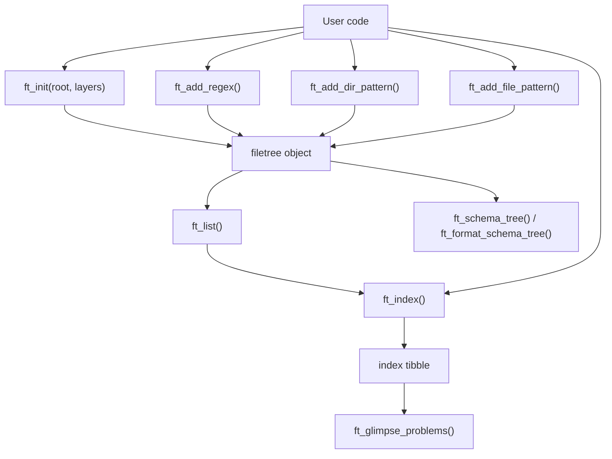
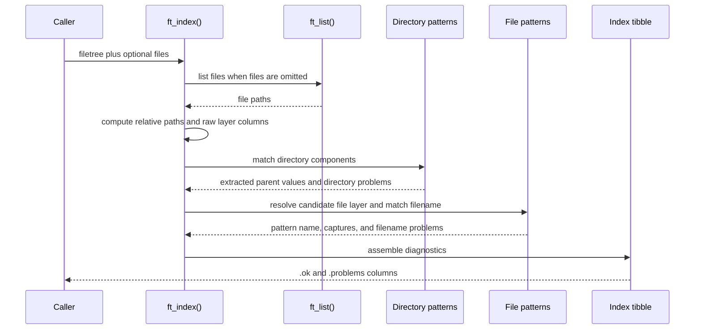

# filetree Overview

This document is durable package context for developers and AI agents. It should
be updated periodically as `filetree` evolves, especially when public APIs,
object structure, indexing semantics, diagnostics, or performance strategy
change.

Future AI-agent work on this package should use the Posit-oriented skills from
<https://github.com/posit-dev/skills> when they are available, and should also
consider relevant skills from <https://github.com/obra/superpowers> if they fit
the task.

## Package Purpose

`filetree` is an R package for declaring, parsing, and validating expected file
hierarchies. A user describes a root directory as ordered layers, registers
reusable regex templates, and attaches directory or file-name patterns to those
layers. The package can then index files under the root, extract metadata from
path components, and report naming or structural problems.

The package is currently a proof-of-concept and API experiment. It is already
useful for validating structured corpus-like data where directory and file names
encode metadata such as subject, time point, task, or sidecar file type. The
design favors explicit schemas and inspectable output over hidden conventions.

## Goals

- Provide a small, pipe-friendly API for declaring file tree schemas.
- Let users define named regex fragments once and reuse them in patterns with
  `{placeholder}` syntax.
- Validate both directory names and file names while extracting metadata into a
  tibble.
- Detect conflicts when the same extracted field appears in multiple path
  components with different values.
- Support partial schemas during exploration, with strict mode available when
  missing file patterns should become problems.
- Support conditional file patterns through parent-layer values and
  pattern-local regex overrides.
- Provide compact human-facing diagnostics for problem files.
- Make schemas inspectable through text summaries and tree-shaped output.

## Non-Goals and Current Boundaries

- `filetree` does not currently check inventory or completeness, such as whether
  every subject/time combination has all expected files.
- It does not persist indexes or cache filesystem scans.
- It does not model multiple independent schema groups; patterns are registered
  directly by layer.
- It does not enforce a one-file-layer-only tree. File patterns may be attached
  to any configured layer so sidecar files can live beside child directories.
- The README examples are user-owned generated documentation. Edit
  `README.Rmd`, not `README.md`, unless explicitly handling generated output.

## Architecture

Most package behavior lives in `R/filetree.R`. The package currently has one
main S3 class, `filetree`, represented as a list with these slots:

| Slot | Purpose |
| --- | --- |
| `root` | Absolute root path used as the base for indexing. |
| `layers` | Ordered layer names, including the terminal file-name layer. |
| `regex_pool` | Named reusable regex templates. |
| `dir_patterns` | Directory pattern specs for non-terminal layers. |
| `file_patterns` | File-name pattern specs for any configured layer. |

## User-Facing API

| Function | Role |
| --- | --- |
| `ft_init()` | Create a `filetree` object from a root and ordered layer names. |
| `ft_add_regex()` | Register reusable regex templates and recompile existing patterns. |
| `ft_add_dir_pattern()` | Register patterns for directory names at a non-terminal layer. |
| `ft_add_file_pattern()` | Register file-name patterns for files at a layer. |
| `ft_list()` | List files under the configured root. |
| `ft_index()` | Parse, validate, and diagnose files against the schema. |
| `ft_glimpse_problems()` | Print a compact summary of problem files. |
| `ft_format_schema_tree()` | Return tree-shaped schema summary lines. |
| `ft_schema_tree()` | Print the schema tree and invisibly return the `filetree`. |
| `format.filetree()` / `print.filetree()` | Summarize configured roots, layers, regexes, and patterns. |

## Pattern Model

Patterns are character strings that can contain placeholders such as
`{subject}` or `{task}`. Placeholders must resolve to names in the regex pool.
When a pattern is compiled, each placeholder becomes a named capture group. The
internal capture group names are temporary and restored to user-facing
placeholder names after matching.

Regex pool entries may reference other pool entries using the same placeholder
syntax. Recursive expansion is validated for missing names and cycles.

File patterns can also include:

- `when`: exact-match conditions on already extracted fields or raw
  `layer__<name>` values.
- `with`: pattern-local regex overrides that apply to that pattern without
  changing the global regex pool.

This supports cases such as ordinary files on days 1 and 2, but a different
allowed task value on day 3.

## Indexing Flow

`ft_index()` first converts files to paths relative to `ft$root`, splits each
relative path into components, and fills raw `layer__<name>` columns. It assigns
an initial `at_layer` from path depth with `.ft_at_layer_from_parts()`.

Directory patterns are applied before file patterns. This matters because file
patterns may depend on parent metadata through `when`, and because file captures
are checked against values already extracted from parent directories.

After directory extraction, `.ft_resolve_file_layers()` refines `at_layer` for
files that may belong to an earlier layer. This is what allows subject-level
sidecar files such as manifests to be validated by a `subject` file pattern even
when the file sits beside child directories.

The returned tibble contains:

- `.path`, `.rel`, and `at_layer` for path identity and classification.
- `layer__<name>` columns for raw path components.
- one column for every placeholder used by registered patterns.
- `pattern`, the matched file pattern name when one matched.
- `.ok`, a logical problem flag.
- `.problems`, a list-column of user-facing diagnostic messages.

## Diagnostics

Problem messages are stored as strings in `.problems`. Some messages include
`cli` inline markup such as `{.var subject}` and `{.val ab-01}` so
`ft_glimpse_problems()` can render semantic terminal output with
`cli::cli_bullets()`.

Important diagnostic categories include:

- paths deeper than the declared layers;
- files at or above the root;
- directory names that do not match the pattern for their layer;
- file names that do not match applicable file patterns;
- missing file patterns in `strict = TRUE` mode;
- capture conflicts between a filename and an already extracted parent value.

## Schema Display

`ft_format_schema_tree()` and `ft_schema_tree()` provide a tree-shaped view of
the declared schema. Directory layers are shown in order. File patterns are
shown in the parent directory where files for that layer live, using labels
such as `` `time` file:`` and `` `data` file:``. This keeps sidecar files
visually distinct from child directories while still making the owning layer
explicit. Conditional file patterns include `when` annotations, and
pattern-local regex overrides include `with` annotations.

The R source uses Unicode escape sequences for tree branches rather than literal
box-drawing characters so the package source remains ASCII-only.

## Tests and Examples

Primary regression coverage is in `tests/testthat/test-filetree.R`. The tests
exercise:

- successful indexing of well-formed trees;
- problem detection in malformed demo trees;
- regex pool recursion, recompilation, missing references, and cycle errors;
- partial schemas and `strict = TRUE`;
- conditional file patterns and pattern-local regex overrides;
- placeholder names with underscores;
- user-facing problem messages;
- sidecar files registered on parent layers;
- schema tree formatting.

Demo file trees live in `inst/demo-1`, `inst/demo-2`, and `inst/demo-3`.
Additional test fixtures live in `tests/testthat/test-trees`.

Current local test guidance from project notes: `devtools::document()`,
`devtools::test()`, and `testthat::test_local()` work from the repo-local
`renv` library. `testthat::test_local()` is the fastest direct test command;
`devtools::test()` is useful when checking the package-development workflow.

## Code Reference Index

| Area | File | Key Symbols |
| --- | --- | --- |
| Package metadata | `DESCRIPTION` | imports, package description, R version |
| Package namespace | `NAMESPACE` | exported functions and S3 methods |
| Core implementation | `R/filetree.R` | `ft_init()`, `ft_add_regex()`, `ft_add_dir_pattern()`, `ft_add_file_pattern()`, `ft_index()` |
| Pattern compilation | `R/filetree.R` | `.ft_placeholders()`, `.ft_compile_pattern()`, `.ft_expand_pool_regex()`, `.ft_recompile_patterns()` |
| Conditional matching | `R/filetree.R` | `.ft_normalize_when()`, `.ft_when_matches()`, `.ft_file_pattern_matches()` |
| File-layer resolution | `R/filetree.R` | `.ft_at_layer_from_parts()`, `.ft_candidate_file_layers()`, `.ft_resolve_file_layers()` |
| Diagnostics | `R/filetree.R` | `ft_glimpse_problems()`, `.ft_validate_index()` |
| Schema display | `R/filetree.R` | `ft_format_schema_tree()`, `ft_schema_tree()`, `.ft_format_schema_dir()` |
| S3 display | `R/filetree.R` | `format.filetree()`, `print.filetree()` |
| Tests | `tests/testthat/test-filetree.R` | package behavior and regression coverage |
| User examples | `README.Rmd` | current public examples and development notes |

## Glossary

| Term | Meaning |
| --- | --- |
| layer | A named level of the expected path hierarchy. The final layer represents file names. |
| directory layer | Any layer before the final file-name layer. |
| file pattern | A pattern that validates and extracts metadata from a file name at a specific layer. |
| directory pattern | A pattern that validates and extracts metadata from a directory name at a specific layer. |
| regex pool | Named regex templates reusable from `{placeholder}` syntax. |
| placeholder | A `{name}` token in a pattern that compiles to a capture using a regex pool entry. |
| extracted field | A tibble column produced by captures from directory or file patterns. |
| `layer__<name>` | A raw path-component column in the index tibble. |
| `at_layer` | The layer where a file is classified for file-pattern validation. |
| sidecar file | A file that belongs to a non-terminal layer, such as a subject manifest beside time directories. |
