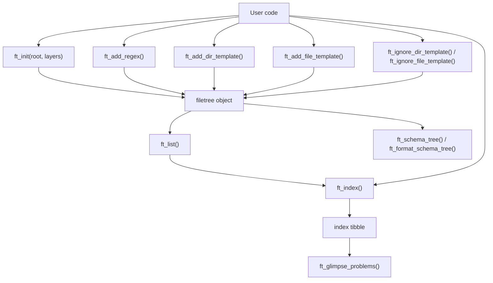
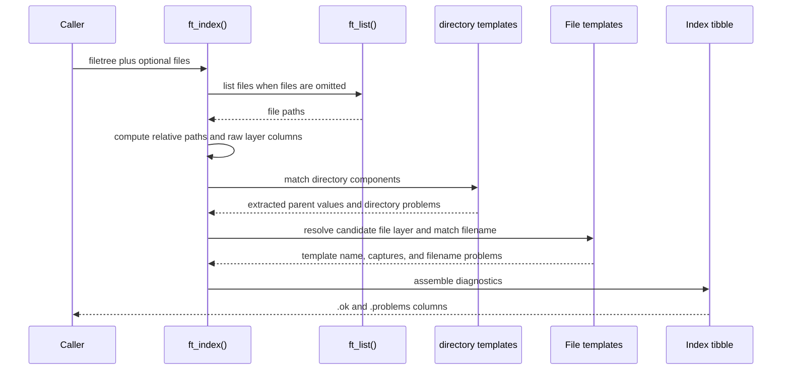

# filetree Overview

This document is durable package context for developers and AI agents. It should
be updated periodically as `filetree` evolves, especially when public APIs,
object structure, indexing semantics, diagnostics, or performance strategy
change.

Future AI-agent work on this package should use the Posit-oriented skills from
<https://github.com/posit-dev/skills> when they are available, and should also
consider relevant skills from <https://github.com/obra/superpowers> if they fit
the task.

## Package Purpose

`filetree` is an R package for declaring, parsing, and validating expected file
hierarchies. A user describes a root directory as ordered layers, registers
reusable field regexes, and attaches directory or file-name templates to those
layers. The package can then index files under the root, extract metadata from
path components, and report naming or structural problems.

The package is currently a proof-of-concept and API experiment. It is already
useful for validating structured corpus-like data where directory and file names
encode metadata such as subject, time point, task, or sidecar file type. The
design favors explicit schemas and inspectable output over hidden conventions.

## Goals

- Provide a small, pipe-friendly API for declaring file tree schemas.
- Let users define named field regexes once and arrange them in component
  templates with `{placeholder}` syntax.
- Validate both directory names and file names while extracting metadata into a
  tibble.
- Detect conflicts when the same extracted field appears in multiple path
  components with different values.
- Support partial schemas during exploration, with strict mode available when
  missing file templates should become problems.
- Support conditional directory and file templates through already extracted
  values and template-local regex overrides.
- Provide compact human-facing diagnostics for problem files.
- Make schemas inspectable through text summaries and tree-shaped output.

## Non-Goals and Current Boundaries

- `filetree` does not currently check inventory or completeness, such as whether
  every subject/time combination has all expected files.
- It does not persist indexes or cache filesystem scans.
- It does not model multiple independent schema groups; templates are registered
  directly by layer.
- It does not enforce a one-file-layer-only tree. File templates may be attached
  to any configured layer so sidecar files can live beside child directories.
- The README examples are user-owned generated documentation. Edit
  `README.Rmd`, not `README.md`, unless explicitly handling generated output.

## Architecture

Most package behavior lives in `R/filetree.R`. The package currently has one
main S3 class, `filetree`, represented as a list with these slots:

| Slot | Purpose |
| --- | --- |
| `root` | Absolute root path used as the base for indexing. |
| `layers` | Ordered layer names that can own directory and file templates. |
| `regex_pool` | Named reusable field regexes. |
| `dir_templates` | Directory template specs for non-terminal layers. |
| `file_templates` | File-name template specs for any configured layer. |
| `ignore_dir_templates` | Directory template specs that prune matching subtrees before validation. |
| `ignore_file_templates` | File-name template specs that prune matching files before validation. |

## User-Facing API

| Function | Role |
| --- | --- |
| `ft_init()` | Create a `filetree` object from a root and ordered layer names. |
| `ft_add_regex()` | Register reusable field regexes and recompile existing templates. |
| `ft_add_dir_template()` | Register templates for directory names at a non-terminal layer. |
| `ft_add_file_template()` | Register file-name templates for files at a layer. |
| `ft_ignore_dir_template()` | Register directory templates for subtrees excluded from indexing. |
| `ft_ignore_file_template()` | Register file-name templates for files excluded from indexing. |
| `ft_set_root()` | Return a filetree with a different root path. |
| `ft_list()` | List files under the configured root, excluding ignored files by default. |
| `ft_index()` | Parse, validate, and diagnose files against the schema. |
| `ft_glimpse_problems()` | Print a compact summary of problem files. |
| `ft_format_schema_tree()` | Return tree-shaped schema summary lines. |
| `ft_schema_tree()` | Print the schema tree and invisibly return the `filetree`. |
| `format.filetree()` / `print.filetree()` | Summarize configured roots, layers, regexes, and templates. |

## Field Regexes and Component Templates

Field regexes define values to extract, such as `subject = "\\w{2}-\\d{2}"`
or `task = "red|green"`. These names become columns in the index when a
matching directory or file component is parsed.

Directory and file templates are full-string component templates. They arrange
fixed text and `{placeholder}` references into the expected complete dirname or
filename for one layer. Fixed text is matched literally, so
`{subject}_{task}.txt` treats `.txt` as a literal extension. A template must
match the whole component, so `day{time}` can match `day01` when
`time = "\\d{2}"`, but it does not match `day01b`.

Placeholders must resolve to names in the regex pool. When a component template
is compiled, each placeholder becomes a named capture group. The internal
capture group names are temporary and restored to user-facing placeholder names
after matching.

Regex pool entries may reference other pool entries using the same placeholder
syntax. Recursive expansion is validated for missing names and cycles.

Directory and file templates can also include:

- `when`: exact-match conditions on already extracted fields or raw
  `layer__<name>` values.
- `with`: template-local regex overrides that apply to that template without
  changing the global regex pool.

This supports cases such as ordinary files on days 1 and 2, but a different
allowed task value on day 3, or different directory naming conventions under
different parent directories.

Directory template registration is keyed by template name within a layer.
Registering another directory template with the same name replaces the earlier
template and warns. Use explicit unique names to keep alternative directory
templates on the same layer.

Public template APIs accept either layer names or positive integer layer
positions. Layer `1` is the first configured layer in `ft$layers`; layer `0` is
the implicit root layer and is not accepted by the current template APIs.
Integer references are normalized to canonical layer names at the public API
boundary, so object storage, diagnostics, schema display, and index output
remain name-based.

Ignored directory and file templates use the same full-component template
language and the same `when` and `with` arguments. They classify paths as
outside the validation contract. Ignored directory templates have subtree
semantics: every file below a matching directory component is ignored. Ignored
file templates match file names at a configured layer, including sidecar-style
layers.

## Indexing Flow

`ft_index()` first converts files to paths relative to `ft$root`, splits each
relative path into directory components plus a basename, fills raw
`layer__<name>` columns from directory components, and stores the basename in
`.filename`. It assigns an initial `at_layer` from path depth with
`.ft_at_layer_from_parts()`.

Before validation, ignore templates classify paths. By default, ignored files
are dropped. With `include_ignored = TRUE`, ignored files remain in the index as
inert audit rows with `.ignored = TRUE`, `.ignore_template`, `.ignore_type`,
`.ok = TRUE`, and empty `.problems`. Ignored rows keep path-derived columns
such as `.path`, `.rel`, `at_layer`, `.filename`, and `layer__<name>`, but they
do not participate in directory validation, file validation, capture extraction,
conflict checks, or strict-mode diagnostics.

For performance, `ft_index()` uses a fast relative-path path when supplied files
are already under `ft$root`, and falls back to `fs::path_rel()` only for paths
outside that direct prefix. File-layer resolution is skipped unless an
immediate parent layer has registered file templates, which avoids row-wise
alternate-owner checks for ordinary data-file trees.

`ft_list()` also applies ignore templates by default so callers can prune files
before building an index. Use `include_ignored = TRUE` to list every file under
the root.

Files outside `ft$root`, or paths equal to the root itself, are immediate
structural problems. They are not matched against directory or file templates.

Directory templates are applied before file templates. This matters because file
templates may depend on parent metadata through `when`, and because file captures
are checked against values already extracted from parent directories.

After directory extraction, `.ft_resolve_file_layers()` refines `at_layer` for
files whose basename may be owned by a nearby layer other than the depth-based
default. This is what allows subject-level manifests and terminal data files to
share the same model: `.filename` stores the basename, and `at_layer` identifies
which layer's file templates validate it.

The returned tibble contains:

- `.path`, `.rel`, and `at_layer` for path identity and classification.
- `.filename`, the raw basename matched by file templates.
- `layer__<name>` columns for raw directory path components.
- one column for every placeholder used by registered templates.
- `template`, the matched file template name when one matched.
- `.ignored`, `.ignore_template`, and `.ignore_type` when
  `include_ignored = TRUE`.
- `.ok`, a logical problem flag.
- `.problems`, a list-column of user-facing diagnostic messages.

## Diagnostics

Problem messages are stored as strings in `.problems`. Some messages include
`cli` inline markup such as `{.var subject}` and `{.val ab-01}` so
`ft_glimpse_problems()` can render semantic terminal output with
`cli::cli_bullets()`.

`ft_glimpse_problems()` groups printed problems by parent directory and
`at_layer`. The `n` argument controls how many problem batches are previewed,
and `n_lines` controls how many problem lines are printed within each batch.
Small hidden remainders are printed in full instead of summarized.

Important diagnostic categories include:

- paths deeper than the declared layers;
- files at or above the root;
- directory names that do not match the template for their layer;
- file names that do not match applicable file templates;
- missing file templates in `strict = TRUE` mode;
- capture conflicts between a filename and an already extracted parent value.

## Schema Display

`ft_format_schema_tree()` and `ft_schema_tree()` provide a tree-shaped view of
the declared schema. Directory layers are shown in order. File templates are
shown in the parent directory where files for that layer live, using labels
such as `` `time` file:`` and `` `data` file:``. This keeps sidecar files
visually distinct from child directories while still making the owning layer
explicit. Conditional directory and file templates include `when` annotations,
template-local regex overrides include `with` annotations, and ignored
templates are shown as ignored directory or file entries.

The R source uses Unicode escape sequences for tree branches rather than literal
box-drawing characters so the package source remains ASCII-only.

`format.filetree()` uses `cli::cli_format_method()` and returns one character
element per printed line. `print.filetree()` prints those lines with newline
separators and invisibly returns the input object. The summary shows the root,
ordered layers, regex pool, directory templates, file templates, ignored
directory templates, and ignored file templates. Directory and file template
rows share the same form, such as
`` subject: default = `{subject}` `` or
`` data: default = `{subject}_{task}.txt` ``, with template strings shown in
backticks. The object summary does not print a separate `file_layer` line.

## Tests and Examples

Primary regression coverage is in `tests/testthat/test-filetree.R`. The tests
exercise:

- successful indexing of well-formed trees;
- problem detection in malformed demo trees;
- regex pool recursion, recompilation, missing references, and cycle errors;
- partial schemas and `strict = TRUE`;
- conditional directory and file templates and template-local regex overrides;
- ignored file templates, ignored directory subtrees, and ignored audit rows;
- placeholder names with underscores;
- user-facing problem messages;
- sidecar files registered on parent layers;
- schema tree formatting;
- S3 `format()` and `print()` output.

Demo file trees live in `inst/demo-1`, `inst/demo-2`, and `inst/demo-3`.
Additional test fixtures live in `tests/testthat/test-trees`.

Current local test guidance from project notes: `devtools::document()`,
`devtools::test()`, and `testthat::test_local()` work from the repo-local
`renv` library. `testthat::test_local()` is the fastest direct test command;
`devtools::test()` is useful when checking the package-development workflow.

## Code Reference Index

| Area | File | Key Symbols |
| --- | --- | --- |
| Package metadata | `DESCRIPTION` | imports, package description, R version |
| Package namespace | `NAMESPACE` | exported functions and S3 methods |
| Core implementation | `R/filetree.R` | `ft_init()`, `ft_set_root()`, `ft_add_regex()`, `ft_add_dir_template()`, `ft_add_file_template()`, `ft_ignore_dir_template()`, `ft_ignore_file_template()`, `ft_index()` |
| template compilation | `R/filetree.R` | `.ft_placeholders()`, `.ft_compile_template()`, `.ft_expand_pool_regex()`, `.ft_recompile_templates()` |
| Conditional matching | `R/filetree.R` | `.ft_normalize_when()`, `.ft_when_matches()`, `.ft_file_template_matches()` |
| File-layer resolution | `R/filetree.R` | `.ft_at_layer_from_parts()`, `.ft_candidate_file_layers()`, `.ft_resolve_file_layers()` |
| Layer resolution | `R/filetree.R` | `.ft_resolve_layer()`, `.ft_is_integerish()` |
| Ignore classification | `R/filetree.R` | `.ft_classify_ignored()`, `.ft_has_ignore_templates()` |
| Diagnostics | `R/filetree.R` | `ft_glimpse_problems()`, `.ft_validate_index()` |
| Schema display | `R/filetree.R` | `ft_format_schema_tree()`, `ft_schema_tree()`, `.ft_format_schema_dir()` |
| S3 display | `R/filetree.R` | `format.filetree()`, `print.filetree()` |
| Tests | `tests/testthat/test-filetree.R` | package behavior and regression coverage |
| User examples | `README.Rmd` | current public examples and development notes |

## Glossary

| Term | Meaning |
| --- | --- |
| layer | A named level of the expected path hierarchy that can own directory or file templates. |
| integer layer reference | A positive integer position into `ft$layers`; `1` is the first configured layer, while `0` is the implicit inaccessible root. |
| directory layer | Any layer before the final layer; these layers can have directory templates for child paths and file templates for files they own. |
| file template | A full-string component template that validates and extracts metadata from a file name at a specific layer. |
| directory template | A full-string component template that validates and extracts metadata from a directory name at a specific layer. |
| ignored directory template | A full-string component template that excludes every file below a matching directory component. |
| ignored file template | A full-string component template that excludes matching files from listing and indexing. |
| regex pool | Named field regexes reusable from `{placeholder}` syntax. |
| placeholder | A `{name}` token in a component template that compiles to a capture using a regex pool entry. |
| extracted field | A tibble column produced by captures from directory or file templates. |
| `layer__<name>` | A raw directory path-component column in the index tibble. |
| `.filename` | The raw basename matched by file and ignored-file templates. |
| `at_layer` | The layer whose file templates own `.filename`. |
| sidecar file | A file that belongs to a non-terminal layer, such as a subject manifest beside time directories. |
